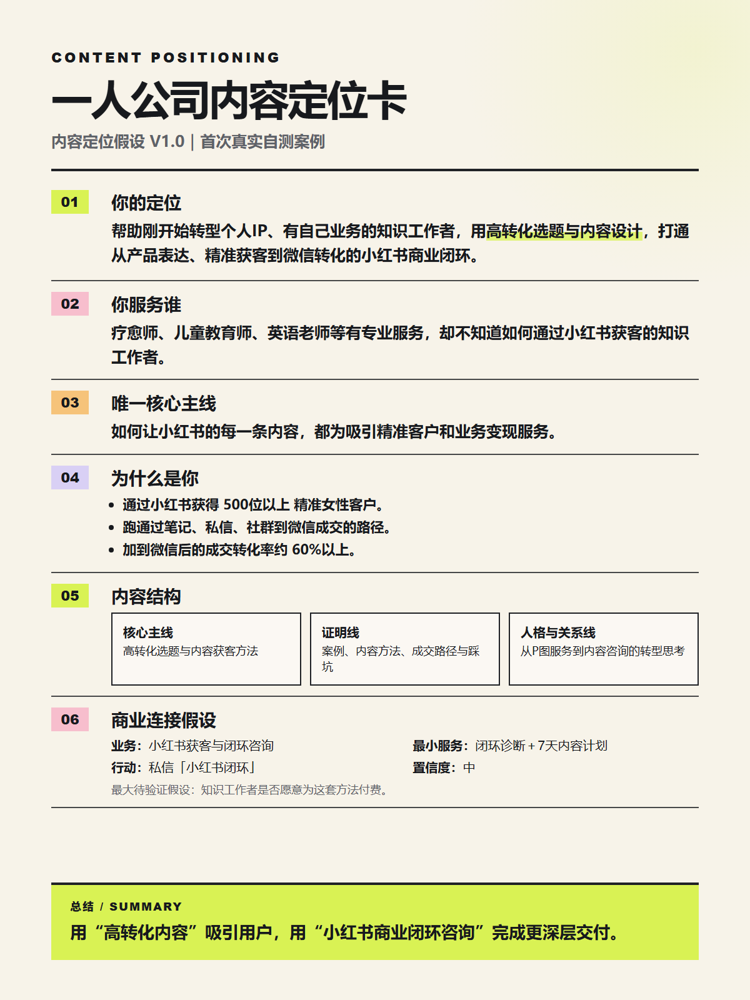
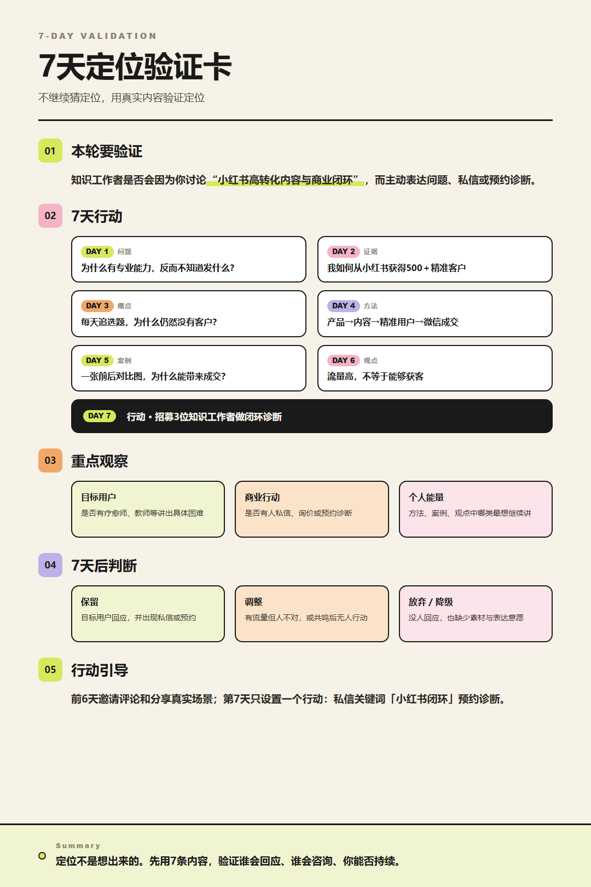

# Hedy Content Positioning

An interview-driven Agent Skill for solo business owners who need a clear, testable content positioning.

> Status: `v0.2.3` beta. Repository structure, format, encoding, and privacy checks pass. Knowledge cards now follow a fixed palette, type scale, spacing system, component library, and semantic color rules. Real-user behavioral validation is still being collected.

## What it does

It helps creators with real expertise or an existing business turn evidence, audience needs, business goals, and sustainable expression into:

- one concise content positioning card;
- one 7-day validation action card;
- one priority audience and one central content line;
- a lightweight business-connection hypothesis;
- retain, adjust, or downgrade/stop decision rules.

The result is a testable “Content Positioning Hypothesis V1.0,” not a permanent identity claim. Version 0.2 also includes conditional audits for existing accounts and long-term expression energy.

## Example output

These cards come from the creator's first real self-test. They demonstrate the final deliverable, but do not claim that paid demand among the target audience has already been validated.

<p align="center">
  <a href="assets/examples/hedy-content-positioning-card.png"></a>
  <a href="assets/examples/hedy-7-day-validation-card.png"></a>
</p>

## Who it is for

Use it when you have professional experience or a business foundation, but your content feels scattered or disconnected from your work.

## Install across compatible agents

This project follows the open [Agent Skills specification](https://agentskills.io/) and has been verified as discoverable by the universal `skills` installer.

With Node.js installed, run:

```bash
npx skills add HedyZhang00/hedy-content-positioning --skill hedy-content-positioning -g
```

The installer can detect or prompt for compatible agents, including Codex, Claude Code, Cursor, GitHub Copilot, and OpenCode.

To target a specific agent:

```bash
# Codex
npx skills add HedyZhang00/hedy-content-positioning --skill hedy-content-positioning -g -a codex

# Claude Code
npx skills add HedyZhang00/hedy-content-positioning --skill hedy-content-positioning -g -a claude-code

# Cursor
npx skills add HedyZhang00/hedy-content-positioning --skill hedy-content-positioning -g -a cursor
```

To install it for every supported agent detected on the computer:

```bash
npx skills add HedyZhang00/hedy-content-positioning --skill hedy-content-positioning -g --agent '*'
```

Restart the agent or open a new conversation after installation. Products that do not support the Agent Skills standard may require a different extension mechanism.

For manual installation, copy `skills/hedy-content-positioning` into the target agent's Skills directory.

## Invoke

```text
$hedy-content-positioning
```

## Language note

Version 0.2.1 is designed and evaluated primarily for Chinese interviews and Chinese content strategy. The English README explains the project but does not claim equivalent English-language evaluation.

## License

[MIT](LICENSE) © 2026 Hedy
